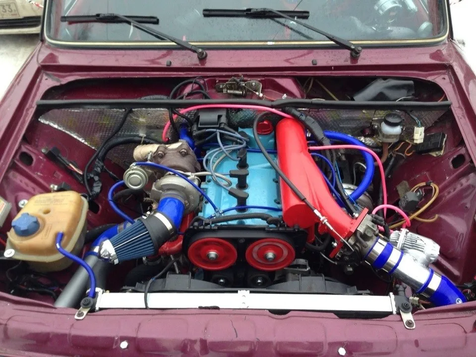

# STEP MOTOR CONTROL v2.0



Футуристическое приложение для управления шаговым двигателем с графическим интерфейсом и анимацией.


## 📋 О проекте

Приложение **STEP MOTOR CONTROL v2.0** представляет собой продвинутую систему управления шаговым двигателем с современным футуристическим интерфейсом. Программа включает в себя:

- 🎛️ **Полнофункциональную панель управления**
- 🎨 **Реалистичную анимацию двигателя**
- 📊 **Систему мониторинга параметров**
- 🔄 **Поддержку различных режимов работы**

## Особенности

### 🎨 Футуристический дизайн
- **Темная тема** с неоновыми акцентами
- **Анимированные элементы** интерфейса
- **Современная цветовая схема** (#0a0a0a, #00f3ff, #9d00ff, #00ff9d)
- **Эффекты свечения и пульсации**

### ⚙️ Функциональность
- **Управление скоростью** (1-500 шагов/сек)
- **Выбор направления** вращения (по/против часовой)
- **Запуск/остановка/сброс** двигателя
- **Шаговое управление** (±1, ±10 шагов)
- **Режим симуляции** работы двигателя

### 📊 Мониторинг
- **Отслеживание позиции** и общего количества шагов
- **Мониторинг температуры** двигателя
- **Контроль мощности** потребления
- **Измерение крутящего момента**
- **Визуальные индикаторы** состояния

### 🎮 Визуализация
- **Анимированная модель** шагового двигателя
- **Подсветка активных** катушек
- **Вращение ротора** в реальном времени
- **Индикатор текущего** положения
- **Отображение магнитов** (N/S полюса)

## 🚀 Установка

### Требования
- Python 3.6 или выше
- Библиотека Tkinter (обычно входит в стандартную поставку Python)

### Установка из исходников
```bash
# Клонирование репозитория
git clone https://github.com/yourusername/step-motor-control.git
cd step-motor-control

# Запуск приложения
python stepper_motor_control.py
```

## 🖥️ Использование

### Панель управления
1. **Регулировка скорости** - используйте слайдер для установки скорости вращения
2. **Выбор направления** - кнопки "По часовой" / "Против часовой"
3. **Управление двигателем** - кнопки "Запуск", "Стоп", "Сброс"
4. **Шаговое управление** - кнопки для точного позиционирования

### Визуализация
- **Центральный круг** - ротор двигателя
- **Цветные кружки** вокруг - магниты (красный/синий = N/S)
- **Серые круги** по краям - статорные катушки
- **Зеленый индикатор** - текущее положение
- **Подсвеченные катушки** - активные в данный момент

### Мониторинг
- **Позиция** - текущий шаг двигателя
- **Всего шагов** - общее количество выполненных шагов
- **Температура** - имитация нагрева двигателя
- **Мощность** - потребляемая мощность
- **Момент** - крутящий момент

## 🏗️ Архитектура

### Основные классы
```python
FuturisticStepperMotorControl
├── setup_styles()        # Настройка стилей интерфейса
├── setup_ui()            # Построение пользовательского интерфейса
├── setup_motor_animation() # Инициализация анимации двигателя
├── start_motor()         # Запуск двигателя
├── stop_motor()          # Остановка двигателя
├── animate_motor()       # Анимация работы двигателя
└── rotate_motor()        # Вращение ротора
```

### Потоки выполнения
- **Основной поток** - GUI и обработка событий
- **Поток анимации** - симуляция работы двигателя
- **Поток обновления** - мониторинг параметров

## 🎨 Дизайн

### Цветовая схема
```python
colors = {
    "bg_dark": "#0a0a0a",      # Темный фон
    "accent_blue": "#00f3ff",  # Акцентный синий (неоновый)
    "accent_purple": "#9d00ff", # Акцентный фиолетовый
    "accent_green": "#00ff9d",  # Акцентный зеленый
    "accent_red": "#ff0066"     # Акцентный красный
}
```

### Шрифты
- **Orbitron** - заголовки и важные элементы
- **Segoe UI** - основной текст интерфейса
- **Consolas** - числовые значения и статистика

## 🔧 Технические детали

### Параметры двигателя
- **Разрешение**: 1.8° на шаг
- **Максимальная скорость**: 500 шагов/сек
- **Режим работы**: Полный шаг
- **Тип драйвера**: Биполярный
- **Количество катушек**: 4
- **Количество магнитов**: 8

### Анимация
- **Плавное вращение** ротора
- **Динамическая подсветка** активных катушек
- **Пульсация индикаторов** состояния
- **Реальное время** обновления позиции

## 📁 Структура проекта

```
step-motor-control/
├── stepper_motor_control.py  # Основной файл приложения
├── README.md                 # Документация (этот файл)
├── requirements.txt          # Зависимости (пустой, так как используются стандартные библиотеки)
├── screenshot.png            # Скриншот приложения
└── LICENSE                   # Лицензия MIT
```

## 🐛 Отладка и решение проблем

### Распространенные проблемы
1. **Нет отображения интерфейса** - проверьте установку Python и Tkinter
2. **Медленная анимация** - уменьшите скорость вращения
3. **Ошибки при закрытии** - используйте корректное завершение через кнопку "Стоп"

### Логирование
Приложение включает базовое логирование в консоль для отслеживания:
- Изменение скорости
- Смену направления
- Запуск/остановку двигателя
- Изменение позиции

## 🔮 Планы развития

### Запланированные улучшения
- [ ] **Поддержка реального оборудования** через GPIO/Raspberry Pi
- [ ] **Расширенные режимы** работы (полушаг, микрошаг)
- [ ] **Сохранение профилей** настроек
- [ ] **Графики параметров** в реальном времени
- [ ] **Экспорт данных** в CSV/JSON
- [ ] **Мультиязычная поддержка**

### Возможные интеграции
- **Raspberry Pi GPIO** для управления реальными двигателями
- **Arduino** через последовательный порт
- **PLC контроллеры** через Modbus
- **Веб-интерфейс** для удаленного управления

## 👥 Вклад в проект

Мы приветствуем вклад в развитие проекта!

### Как помочь
1. Форкните репозиторий
2. Создайте ветку для своей функции (`git checkout -b feature/amazing-feature`)
3. Зафиксируйте изменения (`git commit -m 'Add amazing feature'`)
4. Запушьте ветку (`git push origin feature/amazing-feature`)
5. Откройте Pull Request

### Области для улучшения
- Оптимизация производительности
- Добавление новых визуальных эффектов
- Расширение функциональности управления
- Улучшение документации
- Тестирование на разных платформах


